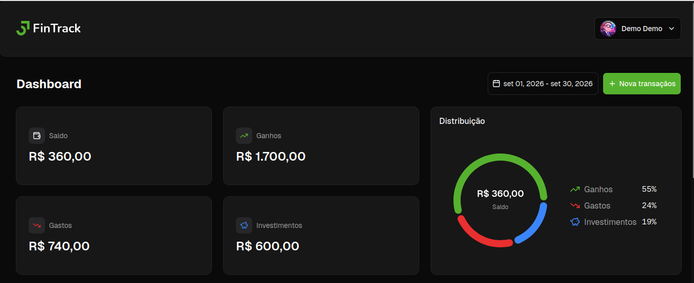
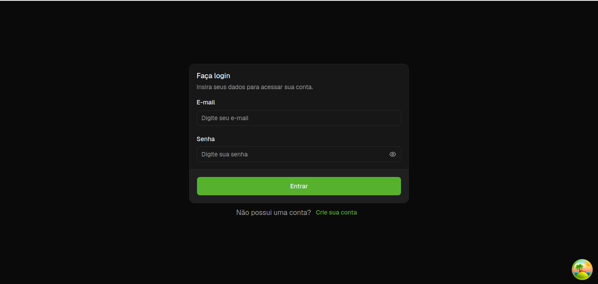
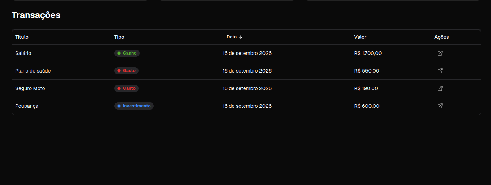

# FinTrack

Frontend de controle financeiro pessoal em React + Vite. Permite criar conta, entrar, visualizar saldos, gráficos e gerenciar transações (receitas, despesas e investimentos) consumindo uma API externa.

> Repositório: [BrenodePaiva/fintrack-app](https://github.com/BrenodePaiva/fintrack-app)

[](https://react.dev/)
[](https://vite.dev/)
[](https://tailwindcss.com/)
[](./README.md#licença)

## Screenshots





> Pasta sugerida: `docs/screenshots/dashboard.png`, `login.png` e `transactions.png`.

## Funcionalidades

- Cadastro, login e sessão com refresh automático de token.
- Dashboard protegido com saldos por período.
- Gráfico de evolução do saldo.
- CRUD de transações (receita, despesa e investimento).
- Filtro de transações por intervalo de datas.
- Tabela de transações com ordenação.
- Verificação de saúde da API antes de liberar o app (loading dedicado).

## Tecnologias

| Categoria   | Tech                                                       |
| ----------- | ---------------------------------------------------------- |
| UI          | React 19, Vite 8, Tailwind CSS v4, shadcn/ui, lucide-react |
| Roteamento  | react-router v8 (rotas declarativas)                       |
| Dados       | TanStack Query v5, TanStack Table v9, axios                |
| Formulários | react-hook-form + zod                                      |
| Gráficos    | recharts                                                   |
| Datas       | date-fns                                                   |
| Qualidade   | ESLint (com `simple-import-sort`), Prettier, husky         |

## Pré-requisitos

- Node.js 24+ e npm 11+ (versões usadas no desenvolvimento: Node 24.11.0, npm 11.6.1).
- Acesso à internet para alcançar a API pública (não é preciso rodar backend local).

## Como rodar

```bash
git clone https://github.com/BrenodePaiva/fintrack-app.git
cd fintrack-app
npm install
npm run dev
```

Acesse `http://localhost:5173` e crie sua conta em `/signup`.

| Comando           | Descrição                                   |
| ----------------- | ------------------------------------------- |
| `npm run dev`     | Sobe o servidor de desenvolvimento          |
| `npm run build`   | Gera o build de produção em `dist/`         |
| `npm run preview` | Serve o build localmente                    |
| `npm run lint`    | Roda o ESLint (inclui ordenação de imports) |

## Backend / API

Este repositório contém **somente o frontend**. A API é externa e pública:

- Base URL: `https://finance-app-api-9q4g.onrender.com/api`
- Configuração hardcoded em `src/constants/api.js` (`API_URL`).
- Não há `.env` neste projeto.
- Autenticação via Bearer token, com interceptor de refresh em `src/lib/axios.js`.

Para apontar para outro backend, altere o `API_URL` em `src/constants/api.js`.

## Estrutura do projeto

```text
src/
├── api/            # services (user, transaction, health) + hooks (react-query)
├── components/     # header, balance, charts, tabela, botões + ui/ (shadcn)
├── constants/      # API_URL, chaves de localStorage
├── contexts/       # AuthContext (usuário, sessão)
├── forms/          # schemas zod + hooks de formulário
├── helpers/        # formatação e utilidades
├── lib/            # axios (publicApi/protectedApi), utils
├── pages/          # home (dashboard), login, signup, not-found
├── App.jsx         # atualmente não é usado como entry point
└── main.jsx        # entry point: providers, router e rotas
```

## Rotas

| Rota      | Acesso      | Descrição                               |
| --------- | ----------- | --------------------------------------- |
| `/`       | Autenticado | Dashboard (saldos, gráfico, transações) |
| `/login`  | Público     | Login                                   |
| `/signup` | Público     | Criação de conta                        |
| `*`       | Público     | Página 404                              |

Usuários não autenticados em `/` são redirecionados para `/login`.

## Convenções

- Alias `@` aponta para `src/` (configurado em `vite.config.js` e `jsconfig.json`).
- Prettier: sem ponto e vírgula, aspas simples, `trailingComma: es5`.
- ESLint exige imports ordenados (`simple-import-sort`) — `npm run lint` falha se estiver fora de ordem.
- Hooks de commit (husky + lint-staged) aplicam `prettier --write` e `eslint --fix` nos arquivos staged.

## Licença

Licença ainda não definida.
